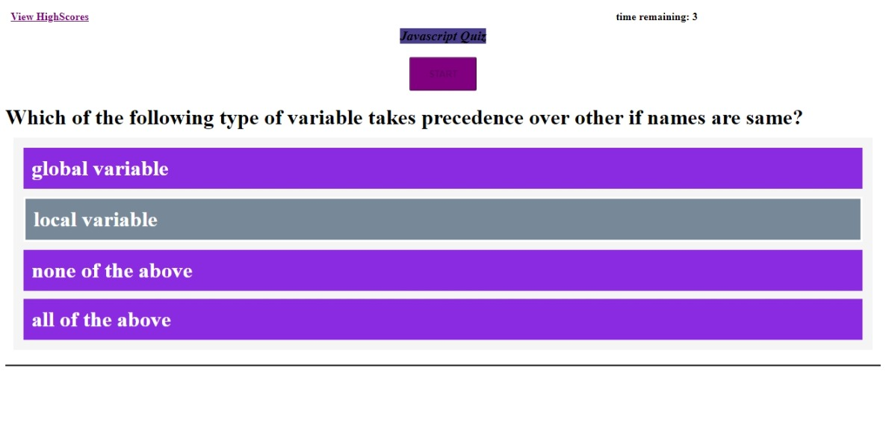

``` diff
# quiz_javascript
```

A Javascript Quiz

Click on start button to start the quiz,timer starts immediately after.

hovering on the options would result in change in background color.

on selecting every wrong option, timer reduces by 3 seconds.

If timer reaches 0 seconds or number of questions end , a form is rendered.

This form renders your score and gets user name value.

user name and score are stored in local storage as objects.

If user score is highest, then it is also stored in highest score object in local storage.

On clicking "view highscore" link , a new window opens up which displays highest score and corresponding user name.
``` diff
+Screenshots:
```





``` diff 
#live app link :
```
 https://rajnidua.github.io/quiz_javascript/
